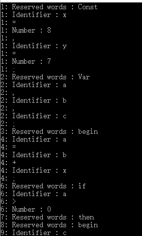
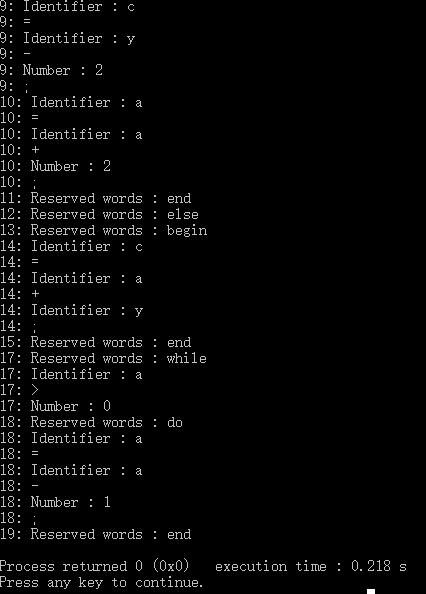

# Compilers-Hdu

#### 记录杭州电子科技大学编译原理上机代码

------

> * 词法分析
> * 语法分析
> * 中间代码生成


## 测试代码

```fortran

Const x=8,y=7;
Var a,b,c;
begin
   a=b+x;
    
    if a>0
       then 
       begin
         c=y - 2 ;
         a=a+2;
       end
    else
       begin
         c=a+y;
       end
   
    while a>0
      do  a=a-1;
end


```

## 词法分析






